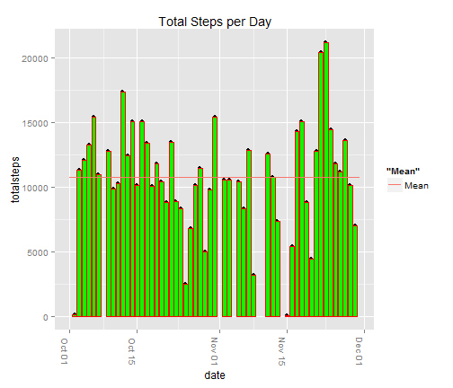
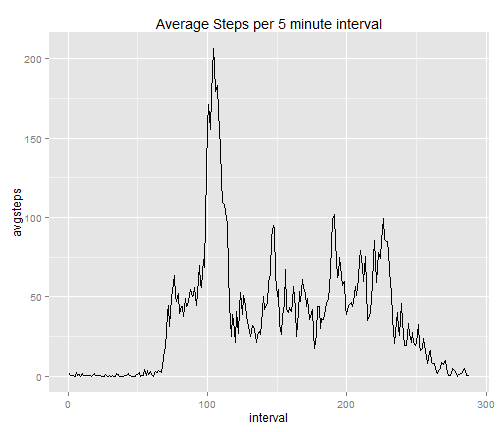
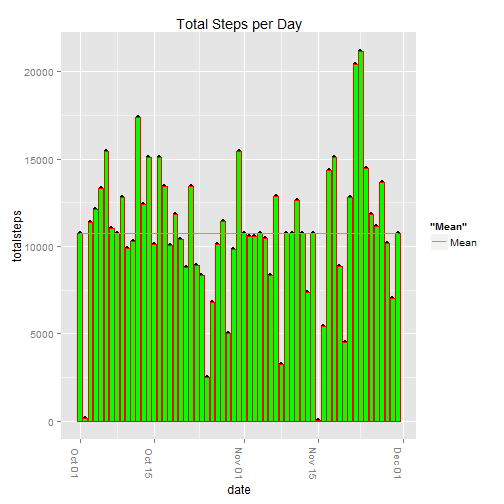
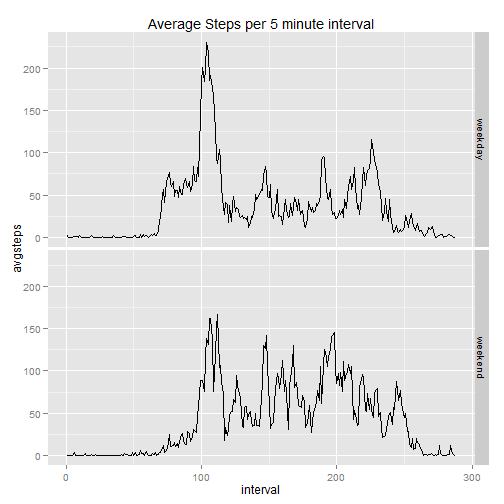

# Activity Tracking Analysis

This assignment makes use of data from a personal activity monitoring device. This device collects data at 5 minute intervals through out the day. The data consists of two months of data from an anonymous individual collected during the months of October and November, 2012 and include the number of steps taken in 5 minute intervals each day.

## Read and transform data
Read the data from the "activity.csv" file and apply the date format to that variable.  
The interval variable specifys the time of day of that 5 minute interval. This variable is  changed to a factor and then a numeric to enable plotting of the 288 intervals across the day in a uniform fashion.  
The libraries ggplot2,lubridate and dplyr will be invoked  but I have suppressed the messages on these libraries.

Below is a histogram of the total number of steps taken each day. The horizontal line is the mean value.

The mean and median values are very close so you cannot differentiate on the graph.


```r
data<-read.csv("activity.csv")
data$date<-ymd(data$date)
data$interval<-as.numeric(as.factor(data$interval))
stepsByDay <- data %>%
  group_by(date) %>%
  summarise(totalsteps = sum(steps))
Mean<-mean(stepsByDay$totalsteps,na.rm=TRUE)
Median<-median(stepsByDay$totalsteps,na.rm=TRUE)
```
The mean value of total number of steps taken per is 1.0766189 &times; 10<sup>4</sup>.  
The median value of total number of steps taken per is 10765.


```r
g<-ggplot(stepsByDay, aes(date,totalsteps)) 
g+geom_point() + geom_bar(stat="identity",colour="red",fill="green")+
  labs(title="Total Steps per Day")+
  theme(axis.text.x=element_text(angle=-90))+
  geom_line(aes(date,Mean,colour="Mean"))
```

 

The following is a  time series plot of the 5-minute interval (x-axis) and the average number of 
steps taken, averaged across all days (y-axis)

```r
avgByInt <- data %>%
  group_by(interval) %>%
  summarise(avgsteps = mean(steps,na.rm=TRUE))
g<-ggplot(avgByInt, aes(interval,avgsteps)) 
g+geom_line()+labs(title="Average Steps per 5 minute interval")
```

 

The maximum number of steps and the corresponding 5-minute interval is shown below.

```r
avgByInt[which.max(avgByInt$avgsteps),]
```

```
## Source: local data frame [1 x 2]
## 
##     interval avgsteps
## 104      104 206.1698
```

```r
NArows<-sum(is.na(data$steps))
```
## Handling Missing Values
The only variable with missing value is "steps".
The total number of missing values in the dataset is 2304

The missing values in the dataset have been replaced by the mean of total steps for that 5-minute interval across all days.  

```r
data2<-data
data2$steps[is.na(data2$steps)]<-avgByInt$avgsteps
stepsByDay <- data2 %>%
  group_by(date) %>%
  summarise(totalsteps = sum(steps))
Mean<-mean(stepsByDay$totalsteps)
Median<-median(stepsByDay$totalsteps)
g<-ggplot(stepsByDay, aes(date,totalsteps)) 
g+geom_point() + geom_bar(stat="identity",colour="red",fill="green")+
  labs(title="Total Steps per Day")+
  theme(axis.text.x=element_text(angle=-90))+
  geom_line(aes(date,Mean,colour="Mean"))
```

 

The new mean value of total number of steps taken per day is 1.0766189 &times; 10<sup>4</sup>. This is identical to the previous value (to 3 decimal places). The new median value is now equal to the mean. Hence imputing the NAs has resulted in the median value converging to the mean.

## Differences in activity patterns between weekdays and weekends
The following adds a new variable in the dataset with two values - "weekday" and "weekend" indicating whether a given date is a week day or weekend day.  

```r
data2$day<-weekdays(data2$date)
days<-data.frame(day=c("Monday","Tuesday","Wednesday","Thursday","Friday","Saturday","Sunday"),cat=c("weekday","weekday","weekday","weekday","weekday","weekend","weekend"))
data2<-merge(data2,days)
avgByInt <- data2 %>%
  group_by(interval,cat) %>%
  summarise(avgsteps = mean(steps))
```
The following creates a panel plot containing a time series plot of the 5-minute interval (x-axis)
and the average number of steps taken, averaged across all weekday days or weekend days (y-axis).

```r
g<-ggplot(avgByInt, aes(interval,avgsteps))
g+geom_line()+labs(title="Average Steps per 5 minute interval")+
  facet_grid(cat ~ .)
```

 


